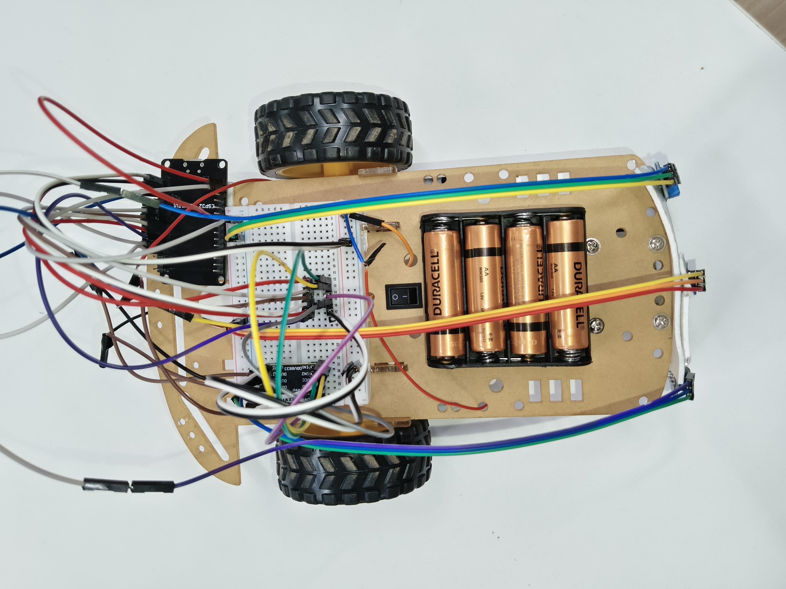

# Line Follower Robot (LFR)

This project is a **Line Follower Robot (LFR)** created as part of the **NST Robotics Club activity**.  
The robot uses **IR sensors** to detect the path and controls **DC motors** accordingly to follow the line.

---

## Features
- Detects black and white surfaces using IR sensors.
- Moves forward when aligned with the path.
- Turns left or right based on sensor input.
- Stops when all sensors detect black.

---

## Hardware Used
- **ESP32** (Microcontroller)
- **IR Sensors** (3x for Left, Middle, Right detection)
- **L293D / Motor Driver**
- **DC Motors** (Left and Right motors)
- **Chassis & Wheels**
- **Power Supply**

---

## Pin Connections

| Component   | Pin |
|-------------|-----|
| IR Left     | 13  |
| IR Middle   | 32  |
| IR Right    | 33  |
| Motor A IN1 | 14  |
| Motor A IN2 | 27  |
| Motor B IN1 | 26  |
| Motor B IN2 | 25  |

---

## Working Principle

- **IR Sensors** detect the line (black = 1, white = 0).
- Based on sensor readings, the robot decides its movement:
  - **Forward** → Middle sensor = 1, Left & Right = 0
  - **Left Turn** → Left sensor = 1, others = 0
  - **Right Turn** → Right sensor = 1, others = 0
  - **Stop** → All sensors = 1

---

## Robot Image


---

## How to Run
1. Connect the hardware as per the pin configuration.
2. Upload the Arduino code to the ESP32.
3. Power the robot and place it on a black line track.
4. Watch the robot follow the path automatically.

---

## File Structure
```
LFR_Project
│── LFR.ino      # Arduino code for ESP32
│── README.md    # Project documentation (this file)
│── robot.png    # Image of the robot 
```

---

## Acknowledgement
This project was built as part of the **NST Robotics Club Activity**, encouraging students to explore **robotics, embedded systems, and IOT**.

---
